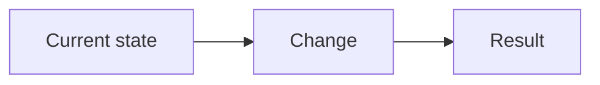

## Summary

Describe the intent and scope of the change.

## Specification / issue

Link the active Spec Kit specification, issue, or decision record.

## Verification

List the commands actually run and their results. Do not list commands that were not executed.

## Risk and rollout

Describe compatibility, data, security, operational, and rollback considerations.

## Mermaid change diagram

Every PR must include a Mermaid diagram that explains the changed flow, architecture, or lifecycle.

## QA handoff

- Acceptance criteria covered:
- Positive scenarios:
- Negative/boundary scenarios:
- Regression areas:
- Manual verification needed:

## Release impact

- [ ] No release note needed
- [ ] Patch
- [ ] Minor
- [ ] Major
