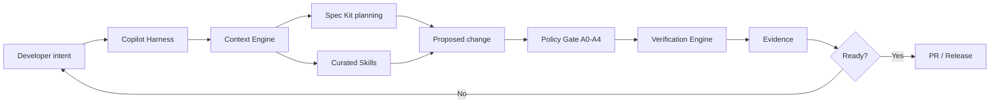
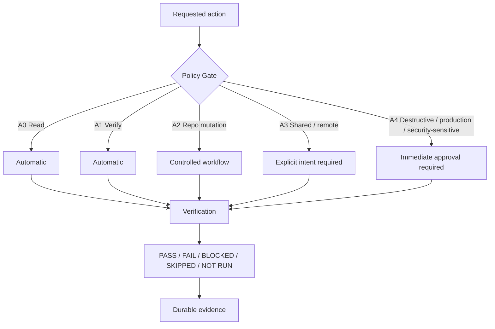
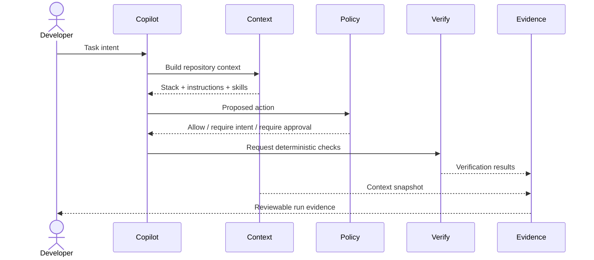
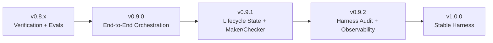

# Copilot Harness

A **repository-native engineering harness for GitHub Copilot** that turns AI-assisted development into a controlled, repeatable, and evidence-driven workflow.

Instead of relying on prompts alone, Copilot Harness gives the repository executable rules for **context, planning, authorization, verification, evidence, and quality feedback**.

> **Copilot proposes; the harness verifies.**

## What it does

Copilot Harness sits around the AI-assisted development workflow. It helps Copilot understand the repository, selects relevant engineering guidance, constrains what may execute automatically, runs deterministic verification, and records evidence that can be reviewed by developers and QA.



The model is intentionally asymmetric: AI can reason and propose broadly, but **authorization and acceptance are controlled by deterministic harness components**.

## Core capabilities

| Capability | What it provides |
| --- | --- |
| **Context Engine** | Detects stack, changed files, instructions, verification configuration, CodeGraph availability, task intent, and selected skills. |
| **GitHub Spec Kit** | Provides the supported Spec-Driven Development planning workflow. |
| **Curated Skills** | Selects focused engineering guidance for debugging, TDD, verification, and codebase exploration without installing another agent framework. |
| **Policy Gate** | Classifies actions from A0-A4 and requires explicit intent or immediate approval as risk increases. |
| **Verification Engine** | Runs deterministic repository checks and reports PASS, FAIL, BLOCKED, SKIPPED, or NOT RUN. |
| **Stack-aware profiles** | Generates safe verification profiles for detected .NET and Angular projects and recommendations for platform/data stacks. |
| **Evidence Engine** | Persists context, verification output, policy snapshots when supplied, and run summaries under `.copilot-harness/runs/`. |
| **Harness Evals** | Regression-tests stack detection, skill selection, policy decisions, and evidence behavior. |
| **CodeGraph integration** | Adds semantic codebase context through the official CLI while keeping it separate from verification evidence. |
| **Installer + Doctor** | Bootstraps the harness on Windows and exposes deterministic human + JSON readiness diagnostics. |
| **Windows CI** | Exercises harness contracts through GitHub Actions smoke and regression checks. |

## Safety and verification model

The harness separates **what may be done** from **whether the result is acceptable**.



A verification profile cannot grant itself additional authorization. Curated skills cannot override the Policy Gate. CodeGraph output is context, not proof. Missing verification is never interpreted as success.

## End-to-end runtime



## Supported engineering environment

The harness is Windows-first and designed for teams using **GitHub Copilot Chat in Visual Studio or VS Code**. It currently understands signals for .NET / ASP.NET Core, Angular / TypeScript, SQL Server, MongoDB, Snowflake, Parquet, Azure DevOps, GitHub Actions, and JFrog.

The baseline is deliberately CLI-driven. Optional integrations such as CodeGraph enrich context without turning MCP or marketplace plugins into runtime requirements.

## Repository architecture

```text
scripts/
  context.ps1                  Build deterministic task/repository context
  skills.ps1                   Select curated engineering skills
  policy-check.ps1             Evaluate A0-A4 authorization policy
  verify.ps1                   Run deterministic verification
  record-evidence.ps1          Persist evidence artifacts
  run-harness.ps1              Orchestrate context -> verify -> evidence
  new-verification-profile.ps1 Generate stack-aware verification profiles
  setup-codegraph.ps1          Bootstrap CodeGraph CLI integration

skills/catalog.json             Curated capability catalog
tests/                          Smoke tests and harness evals
installer/                      Windows installation/bootstrap
docs/                           Contracts and implementation guidance
.github/                        Copilot instructions, PR workflow, CI
```

## Roadmap



**v0.9.0 — End-to-End Harness Orchestration** connects task intent, context, curated skills, verification, and durable evidence.

**v0.9.1 — Lifecycle State + Maker/Checker** will make work resumable and strengthen separation between generated work and independent evaluation.

**v0.9.2 — Harness Audit + Observability** will make harness health, failure attribution, and lifecycle coverage measurable.

**v1.0.0 — Stable Harness** will focus on contract stability, representative project validation, upgrade behavior, documentation, and release-quality gates.

## Getting started

Start with the bootstrap and architecture documentation in `docs/`. The installer detects the target repository, installs the supported harness assets, integrates the official GitHub Spec Kit workflow, and records installation metadata.

After installation, use `scripts/doctor.ps1` (or `-Json` in automation) and the verification tooling to validate the environment before relying on harness completion evidence. The readiness contract is documented in `docs/HARNESS-READINESS.md`.

## Branching and releases

This repository uses Git Flow:

- `main` — production/released state
- `develop` — integration
- `feature/*` — new capabilities
- `release/*` — release stabilization
- `hotfix/*` — urgent fixes from `main`

Releases are cut from `release/*`, promoted to `main`, tagged with Semantic Versioning, and synchronized back into `develop`.

Every pull request includes two Mermaid views: a **technical/change diagram** and a **Git Flow branch-position diagram**.

## Design principles

1. **Repository state beats chat history.** Important state and contracts belong in the repository.
2. **Progressive disclosure beats giant prompts.** Load task-relevant context rather than everything.
3. **Generated reasoning is not verification evidence.** Acceptance requires deterministic checks.
4. **Authorization and verification are separate concerns.** Passing a test does not authorize an action.
5. **Fail closed.** Ambiguous high-risk operations and missing evidence do not become implicit success.
6. **Keep the baseline portable.** Optional tooling can enrich the harness without becoming a hidden dependency.
