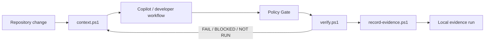

# Context & Evidence Engine

The Context & Evidence Engine closes two gaps in the harness architecture: deterministic context selection before Copilot reasons about a change, and durable local evidence after deterministic verification runs.

## Context builder

Run:

```powershell
.\scripts\context.ps1 -TargetPath . -ChangeType auto
```

The context builder returns detected stacks, changed files, effective change type, relevant Copilot instruction files, verification-profile presence, CodeGraph availability, and the policy/verification entry points.

It does not send repository content anywhere. It builds a compact local context manifest for the repository/terminal workflow.

## Evidence recording

```powershell
.\scripts\record-evidence.ps1 -TargetPath . -ContextPath .\context.json -VerificationPath .\verification.json
```

Evidence is stored under:

```text
.copilot-harness/
  runs/
    <run-id>/
      context.json
      verification.json
      evidence.json
      summary.md
```

Do not store secrets, credentials, private prompts, or hidden model reasoning in the evidence store.

## Orchestrated run

```powershell
.\scripts\run-harness.ps1 -TargetPath . -ChangeType auto
```



The feedback arrow is conceptual: failed verification evidence becomes grounded input for the next implementation iteration.

## CodeGraph role

CodeGraph is one input to the context builder. The harness does not treat CodeGraph output as verification evidence and does not configure its MCP integration. When a local `.codegraph` index is present, the context manifest advertises semantic CLI commands that may help investigate impact and affected code.

## Boundaries

- Context selection is not authorization.
- Model output is not execution evidence.
- Policy decisions remain the responsibility of `scripts/policy-check.ps1`.
- Verification evidence remains the responsibility of `scripts/verify.ps1`.
- The evidence store records metadata and deterministic outputs; it is not a transcript archive.
