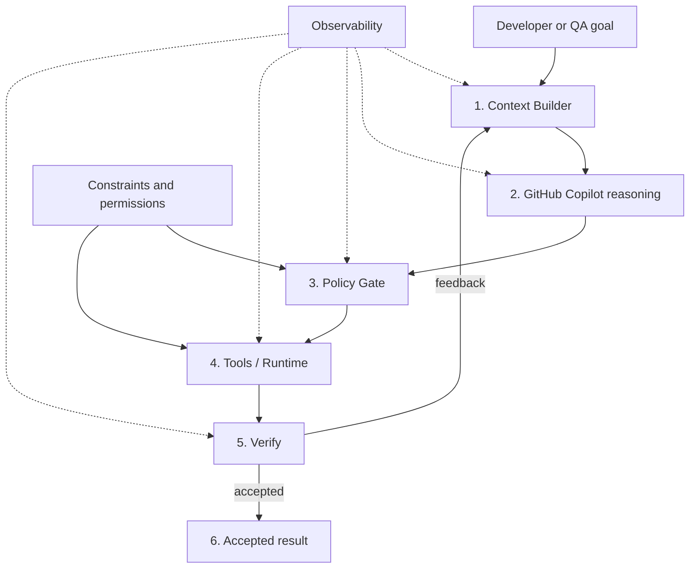

# Harness Engineering

An agent harness is the reliability layer around the LLM. The model supplies reasoning; the harness supplies the context, constraints, execution boundaries, verification, and feedback that make the reasoning dependable enough for engineering work.

The harness must not be reduced to a large system prompt. For this project it is a layered control loop around GitHub Copilot and GitHub Spec Kit.

## Reliability loop

## 1. Context Builder — ground the model

Provide the minimum authoritative context needed for the current task:

- active GitHub Spec Kit feature artifacts;
- repository-wide invariants;
- path-scoped stack instructions;
- relevant source/tests/docs;
- repository state and recent diffs when relevant;
- actual CLI output rather than assumptions.

### Token rule

Context is selected progressively. Do not preload the whole engineering handbook or unrelated specs. Global instructions stay small; path instructions, prompt files, Spec Kit artifacts, and source files are loaded on demand.

## 2. Reasoning — Copilot proposes, it does not certify

GitHub Copilot may analyze, plan, implement, review, or propose commands. A generated answer is not evidence that the repository is correct. Claims about build/test/security/data state require evidence from the verification layer.

GitHub Spec Kit owns the SDD reasoning lifecycle: constitution, specify, clarify, plan, tasks, analyze, implement, and converge.

## 3. Policy Gate — allow or block

Before an action, apply explicit engineering policy:

- no secrets in prompts/source/logs;
- no destructive data action without explicit intent and recovery strategy;
- no unapproved dependency/tool introduction;
- no MCP or marketplace dependency in the company baseline;
- respect architectural boundaries and Git Flow;
- do not bypass tests/SAST/compliance merely to get green status;
- require human review for material changes.

Policy belongs in versioned instructions, scripts, CI/rulesets, and platform permissions where possible. Prompt text alone is not a security boundary.

## 4. Tools / Runtime — grounded execution

On the team's Windows PCs, PowerShell is the canonical shell. The harness may orchestrate approved local tools such as:

- `specify` / GitHub Spec Kit;
- `dotnet`;
- Node/npm/Angular CLI;
- `gh`;
- `az`;
- `jf`;
- approved database tooling;
- repository-local scripts.

The harness should prefer deterministic repository scripts over repeatedly asking the model to invent command sequences.

## 5. Verify — evidence before acceptance

Verification is a separate stage, not a sentence in a prompt. Depending on the change, evidence can include:

- compilation/build;
- unit/integration/e2e tests;
- lint/static analysis;
- GitHub SAST/status checks;
- JFrog artifact/compliance scans;
- schema/data validation;
- Spec Kit acceptance-criteria traceability;
- diff/scope checks;
- QA scenarios.

A failure returns structured feedback to the next iteration. Do not hide or summarize away the actual failure cause.

## 6. Accepted Result — bounded and checked

An accepted result should be bounded by the active specification and backed by verification evidence. Completion means "the requested scope has evidence," not "the model stopped generating." Remaining uncertainty, skipped checks, and manual QA must be visible.

## Cross-cutting concerns

### Constraints

Constraints define what the agent may do: approved CLIs, branch policy, repository scope, security rules, permissions, destructive-action rules, architecture and compliance requirements.

### Observability

For a coding harness, useful observability does not require an LLM telemetry platform. Preserve actionable evidence in normal engineering systems:

- Spec Kit artifacts and task completion;
- Git commits/diffs/PRs;
- commands executed and concise outcomes;
- CI/SAST/JFrog results;
- QA traceability;
- harness `doctor`/validation output.

Do not log secrets or unnecessarily persist full prompts/model conversations.

## Design consequence for this repository

The future installer is only one component of the harness. The complete product has six responsibilities:

1. initialize and select context;
2. configure Copilot/Spec Kit behavior;
3. enforce policy and permissions;
4. expose approved deterministic tools;
5. verify outcomes and feed failures back;
6. preserve evidence for developers, QA, reviewers, and releases.

A useful harness therefore optimizes for reliability per token, not maximum prompt size.