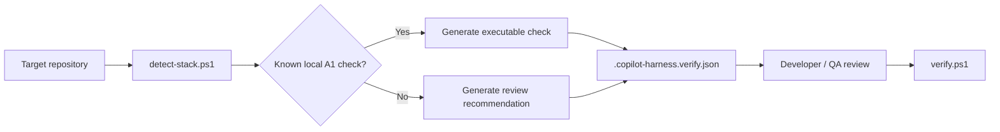

# Stack-Aware Verification Profile Generation

The harness can generate a conservative `.copilot-harness.verify.json` starting point from repository stack detection:

```powershell
.\scripts\new-verification-profile.ps1 -TargetPath .
```

Use `-Json` for machine-readable generation metadata. Existing profiles are preserved by default; replacement requires explicit `-Force`.

## Generation policy

Detection is evidence for configuration, not authorization. The generator creates executable checks only when it can derive a deterministic local A1 command without inventing repository-specific infrastructure details.

Current generated checks:

- .NET detected -> `dotnet build --no-restore` and `dotnet test --no-build --no-restore`.
- Angular detected -> `npm run lint -- --no-fix` when a `lint` script exists.
- Angular detected -> `npm run test:ci` only when that exact non-watch script exists.

The generator does not invent executable database, cloud, artifact, deployment, or security commands. SQL Server, MongoDB, Snowflake, Parquet, Azure DevOps, GitHub Actions, and JFrog detections produce review recommendations until a repository-specific safe verification path is known.

This is intentional. A detected technology does not reveal credentials, environment, database/warehouse, deployment target, or whether a CLI invocation is read-only. Those decisions remain explicit repository configuration and Policy Gate concerns.

## Workflow



## Preservation

The generator fails if `.copilot-harness.verify.json` already exists. This prevents bootstrap or upgrade operations from silently replacing repository-owned verification policy. `-Force` exists for an intentional replacement and should be used only as an explicit repository mutation.

## Target repository branches

This capability does not introduce a branching topology. Generated target-repository guidance continues to support only `feature/*` and `release/*` working branch families and does not assume a `develop` branch.
