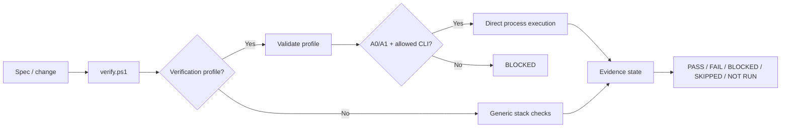

# Copilot Harness v0.4.0 — Repository Verification Profiles

v0.4.0 makes deterministic verification repository-aware while preserving the Policy Gate introduced in v0.3.0.

## Highlights

- `.copilot-harness.verify.json` lets a target solution declare its real deterministic verification commands.
- `scripts/verify.ps1` automatically discovers the profile or accepts an explicit `-ProfilePath`.
- Commands execute as direct executable + argument arrays; the harness does not evaluate shell command strings.
- An explicit CLI allowlist constrains automatic profile execution to supported engineering tools.
- Profile checks are limited to A0/A1. A2-A4 actions cannot become authorized by repository configuration.
- Generic stack-aware verification remains available when a repository has no profile.
- PRs now use two complementary Mermaid views: a technical change diagram and a repository-neutral branch-position diagram.
- Installed target repositories support only `feature/*` and `release/*` working branch families; the harness does not assume a `develop` branch in those solutions.

## Verification flow

## Security boundary

Verification profiles are executable repository configuration and require code review. They cannot authorize deployments, remote mutations, destructive database operations, production actions, or security-sensitive operations. Those remain separate Policy Gate decisions.

## Branch guidance

The harness repository may use its own integration topology while building the tool. That topology is not imposed on installed solutions. Generated target-repository guidance uses only `feature/*` and `release/*` working branch families and represents the PR base branch generically.

## Release verification

See `docs/releases/v0.4.0-testing.md` for the versioned evidence gate. Promotion to `main` requires the mandatory profile scenarios and release-head CI to be resolved according to `docs/RELEASE-TESTING.md`.
