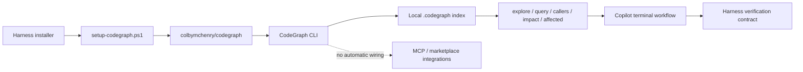

# Copilot Harness v0.5.0 — CodeGraph Integration

v0.5.0 adds semantic code-graph tooling to the harness through the official `colbymchenry/codegraph` project while preserving the existing no-MCP/no-marketplace baseline.

## Highlights

- First-class Windows CodeGraph bootstrap through `scripts/setup-codegraph.ps1`.
- Optional CodeGraph release pinning with `-CodeGraphVersion`.
- Per-repository local graph initialization through `codegraph init`.
- Telemetry is disabled by default unless explicitly retained.
- The installation manifest records CodeGraph source, requested version, initialization intent, telemetry mode, and CLI-only integration mode.
- Dedicated CodeGraph smoke coverage validates source pinning, installer safety, telemetry defaults, initialization, and the absence of automatic MCP/agent wiring.
- Existing harness smoke coverage remains part of the release gate.

## Integration model

## Why CLI-only

CodeGraph supports richer agent wiring through MCP, but this harness release intentionally keeps CodeGraph as a local CLI capability. This preserves compatibility with environments where MCP or marketplace integrations are not available while still enabling semantic repository analysis.

## Release verification

PR #12 merged into `develop` after the Windows `Harness Smoke` workflow completed successfully on commit `222f76c127a52544f9ffee9eacca1cabded55179`.

See `docs/releases/v0.5.0-testing.md` for the release evidence gate used to promote `release/0.5.0` to `main`.
