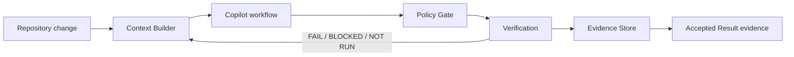

# Copilot Harness v0.6.0 — Context & Evidence Engine

v0.6.0 adds deterministic context selection and durable local verification evidence to the harness.

## Highlights

- `scripts/context.ps1` builds a compact repository context manifest.
- `scripts/run-harness.ps1` orchestrates context, verification, and evidence.
- `scripts/record-evidence.ps1` stores local run evidence under `.copilot-harness/runs/<run-id>/`.
- CodeGraph availability is surfaced as semantic context without treating graph output as verification evidence.
- Relevant Copilot instruction files and verification-profile presence are included in the context manifest.
- Evidence storage explicitly excludes secrets, credentials, private prompts, and hidden model reasoning.

## Architecture

## Verification

PR #14 merged into `develop` as `7d708942c5c287d8bd53c296e65a9386a985cfcc`. Release-head CI on `release/0.6.0` is required before promotion to `main`.
