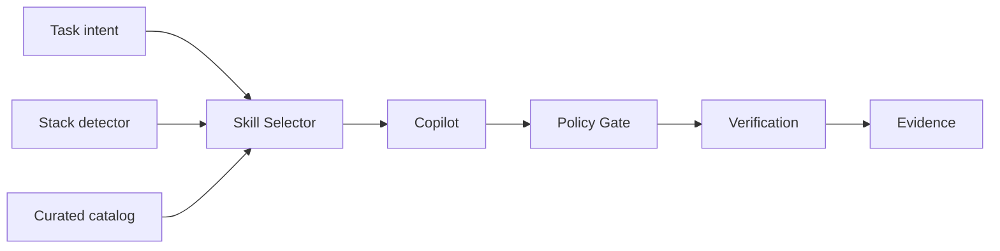

# Copilot Harness v0.7.0 — Curated Skills Capability Layer

v0.7.0 adds deterministic, task-relevant capability selection without installing an overlapping agent framework.

## Highlights

- Curated catalog with upstream provenance.
- `scripts/skills.ps1` selects skills from task intent and detected stack.
- Initial capabilities:
  - systematic debugging
  - test-driven development
  - verification before completion
  - codebase knowledge acquisition
- MCP-required skills are excluded from the baseline.
- Dedicated Windows smoke coverage.

## Authority boundaries

- Spec Kit owns SDD/planning.
- Policy Gate owns execution authorization.
- `verify.ps1` owns deterministic verification evidence.
- CodeGraph provides semantic context.
- Curated skills are advisory capability guidance.

## Architecture

## Verification

PR #18 merged into `develop` as `7545d7ac6a58cee6380edbc9b2d2b1b8fa2a8e38`.

Harness Smoke run #59 completed successfully on feature head `719bc350f915988134ab2feb7b717669dd1fbaa3`.

Release-head CI is required before promotion to `main`.
